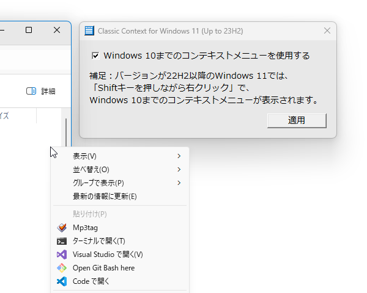

# Classic Context for Windows 11

Classic Context for Windows 11は、Windows 11で更新されたコンテキストメニューを従来(Windows 10まで)のコンテキストメニューに戻す簡易的なソフトです。

Classic Context for Windows 11 is a simple software, that reverts the latest context menus in Windows 11, back to classic context menu (up to Windows 10).

# 使い方（How to use）

本リポジトリのリリースページからインストーラーもしくはzipファイル(ポータブル版)をダウンロードして実行します。インストーラー版は全てのユーザーが利用できるようにするため、インストールに管理者権限が必要です。管理者権限を持たないユーザーのみで利用する場合は、ポータブル版をご利用ください。

Download the installer or zip file (portable version) from the release page of this repository and run it. The installer version requires administrator privileges to install, because it can be used by all users. For all users without administrator privileges, please use the portable version.

- <https://github.com/sakasagiken/win32-classic-context/releases>

従来のコンテキストメニューを戻す際には、再度サインインする必要があります。逆に、最新のコンテキストメニューに戻す際はサインアウトは不要で、即座に反映されます。

You will need to sign back in to restore the classic context menu. Conversely, sign out is not necessary to revert to the latest context menu, and it will take effect immediately.

# 処理内容（How it works）

以下のレジストリキーに指定したレジストリ値を書き込むことで、従来のコンテキストメニューに変更しています。最新のコンテキストメニューに戻す際、このレジストリキーは削除されます。

Modifi classic context menu by writing the specified registry value to the following registry key. Revert to latest context menu by remove  the registry key.

- レジストリキー（Registry key）
    - `HKEY_CURRENT_USER\Software\Classes\CLSID\{86ca1aa0-34aa-4e8b-a509-50c905bae2a2}\InprocServer32`
- レジストリ値（Registry value）
    - 名前（Name）：`(Default)` `(既定)`
    - 種類（Type）：`REG_SZ`
    - データ（Data）：`(NULL)` `(空の文字列)`

詳細は `wWinMain.cpp` をご覧ください。このソフトのすべての処理が、このソースコードに書かれています。

See `wWinMain.cpp` for details. All processing of this software is written in this source code.

# ビルド方法（How to build）

`win32-classic-context.sln` を開くとVisual Studioが起動して、そのままビルドできます。

Just open `win32-classic-context.sln`, Visual Studio will start and it can be built as is.

手動でビルドする際は、`wWinMain.cpp`、`classic-context-icon.rc`、`classic-context-icon.ico` をプロジェクトに取り込んでください。

When building manually, include `wWinMain.cpp`, `classic-context-icon.rc` and `classic-context-icon.ico` into project.

# 注意事項（Notes）

このプログラムはソースコードが公開されているフリーソフトウェアです。個人情報や金銭の窃取、ならびに悪戯を目的としたプログラムではありませんが、使用中もしくは使用後に何らかの障害や損害が発生しても一切の責任を負いません。

This program is open source software. It is not a program intended for stealing personal information or money, or for mischief, but I do not take any responsibility even if some kind of failure or damage occurs during or after use.
